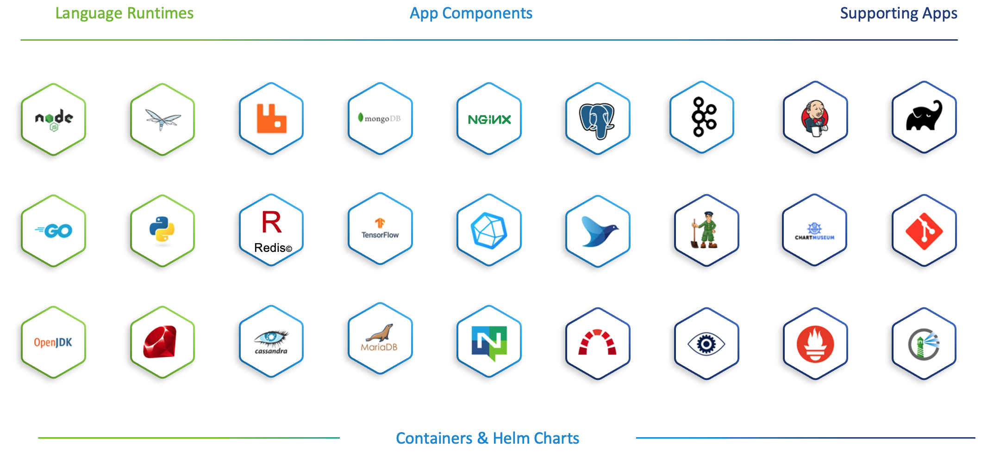

# Vmware Application Catalog-HOL
 

 ## Introduction
본 핸즈온 Lab 문서는 VMware Application Catalog 에 대한 실습을 위한 가이드 문서입니다. 
이 Lab 과정에서는 Application Catalog 서비스에서 제공하는 다양한 application들을 확인하고 On-Premise의 Container Registry(Harbor)로 복사하는 과정을 수행해 봅니다.

## Objectives
* Application Catalog를 사용하는 방법에 대해 알아봅니다.

## 사전 준비 사항
* 인터넷 접속 가능한 PC
* VAC Demo 환경 (강사 제공)
* Harbor (admin 권한 필요): Container Repository (https://goharbor.io/docs/2.4.0/install-config/)
* SSH Terminal (windows Putty, macOS Terminal 등)

* Kubernetes 환경 (예: Tanzu Kubernetes Grid) : Lab3
* Local에 Helm 설치 (https://helm.sh/docs/intro/install/) : Lab3

## Hands-On 순서

Lab 1. [VAC Console UI 살펴보기](vac_console.md)

Lab 2. [VAC --> Harbor : 이미지 전송](vac_onpremise.md)

Lab 3. Kubeapps를 이용해 Chart 설치하기(vac_kubeapps.md)