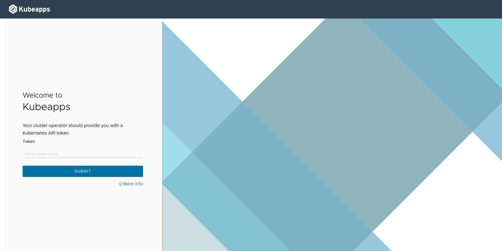
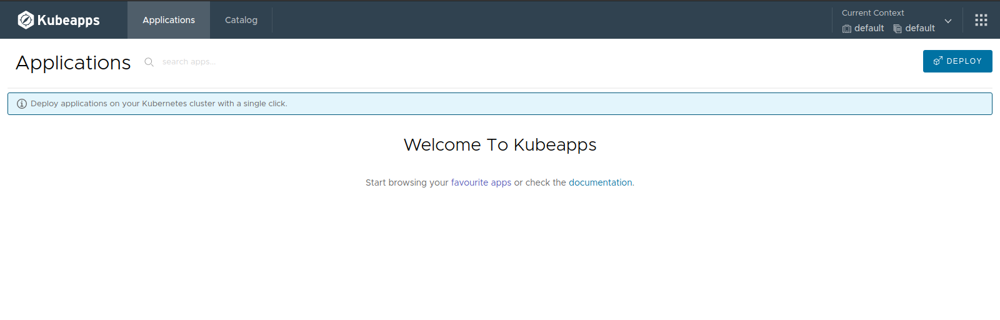

# Kubeapps 설치하기

## 사전 준비 사항
* Kubernetes 환경 (예: Tanzu Kubernetes Grid) 
* Local에 Helm 3.6.x 버전 설치 (https://helm.sh/docs/intro/install/) 
  https://github.com/helm/helm/releases/tag/v3.6.3
```
*** 주의 
Helm 3.7 버전부터 chart를 호출하는 방식이 약간 변경이 되어 에러가 발생함. 
```

## 1. Kubeapps 설치하기

### 1. Kubeapps는 Helm을 이용해 Kubernetes Cluster에 설치합니다.

```
helm repo add bitnami https://charts.bitnami.com/bitnami
kubectl create namespace kubeapps
helm install kubeapps --namespace kubeapps bitnami/kubeapps
```

### 2. 아래 명령어를 실행해서 Demo Credentail을 만들어서 접근해보도록 하겠습니다.

```
kubectl create --namespace default serviceaccount kubeapps-operator
kubectl create clusterrolebinding kubeapps-operator --clusterrole=cluster-admin --serviceaccount=default:kubeapps-operator
```

### 3. Mac & Linux에서는 아래의 명령어를 실행해서 Token을 얻습니다.

```
kubectl get --namespace default secret $(kubectl get --namespace default serviceaccount kubeapps-operator -o jsonpath='{range .secrets[*]}{.name}{"\n"}{end}' | grep kubeapps-operator-token) -o jsonpath='{.data.token}' -o go-template='{{.data.token | base64decode}}' && echo
```
Windows는 다음 참조 : https://github.com/kubeapps/kubeapps/blob/main/docs/user/getting-started.md

### 4. Dashboard 접근하기
다음 명령어로 port forward를 수행합니다.
```
kubectl port-forward -n kubeapps svc/kubeapps 8080:80
```
브라우저에서 http://127.0.0.1:8080/ 에 접근합니다.

Token 값은 위에서 얻은 값을 사용합니다.


정상적으로 로그인이 되면 다음과 같은 화면이 보이게 됩니다. Application과 Catalog 탭을 눌러보면 현재는 아직 아무것도 나오지 않습니다.



이제 Repository를 등록해서 Catalog에 chart목록이 나오도록 해보겠습니다.

[이전으로 가기](./vac_kubeapps.md)

-----
###  인터넷 제한 환경에서 Kubeapps 설치하기

인터넷이 제한된 환경에서 설치를 위해서는 helm-chart를 다운로드 받아서 설치를 하시면 됩니다.

```
helm pull --untar https://charts.bitnami.com/bitnami/kubeapps-4.0.4.tgz
helm dep update ./kubeapps
```
상세 절차는 아래를 참조하시기 바랍니다.

https://github.com/kubeapps/kubeapps/blob/main/docs/user/offline-installation.md


