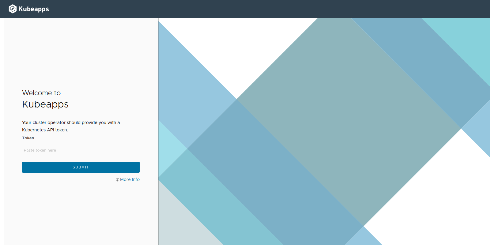
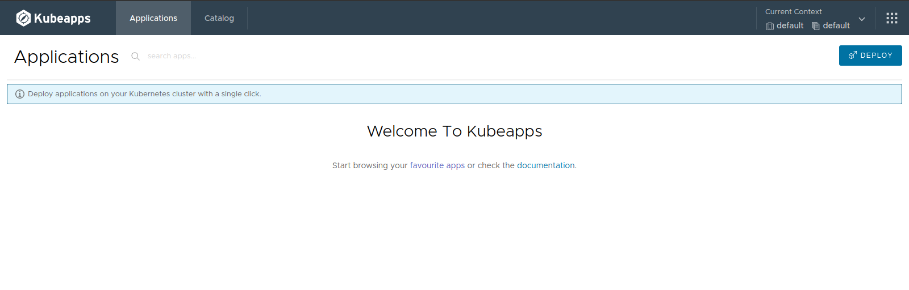

# 인터넷이 제한된 환경에서 Kubeapps 설치하기

## 사전 준비 사항
* Kubernetes 환경 (예: Tanzu Kubernetes Grid) 
* Local에 Helm 3.6.x 버전 설치 (https://helm.sh/docs/intro/install/) 
  https://github.com/helm/helm/releases/tag/v3.6.3
```
*** 주의 
Helm 3.7 버전부터 chart를 호출하는 방식이 약간 변경이 되어 에러가 발생함. 
```

## 1. Kubeapps 설치하기
### 1. Chart 와 이미지 다운로드
다음의 작업은 인터넷이 되는 환경과 제한된 환경에서 각각 수행합니다.

#### [인터넷이 되는 환경에서 수행]
```
helm pull https://charts.bitnami.com/bitnami/kubeapps-8.1.1.tgz
gzip -d kubeapps-8.1.1.tgz
tar -xvf kubeapps-8.1.1.tar 

```
다음 스크립트를 이용해서 chart에서 사용하는 이미지를 추출하고 upload하는 스크립트를 각각 만들어 줍니다.

[이미지 추출 스크립트](./extractImage.sh)

스크립트 실행 방법
Usage : extractImage.sh [chart directory] [Private Image Registry URL] [UserName] [Password]

이 스크립트를 실행하면 아래 두 파일이 생성됩니다.

save.sh : (values.yaml에 들어 있는 모든 이미지를 tar파일로 load에 저장)

save.sh를 실행합니다.

bitnami 폴더가 생성이 되고 그 안에 이미지들이 압축되어 저장됩니다.
bitnami 폴더의 파일들을 인터넷이 제한된 환경으로 옮깁니다.

#### [아래 과정은 인터넷이 제한된 환경에서 수행]

위와 동일하게 tar 파일을 압축해제합니다.

load.sh : (local에 저장되어 있는 tar파일을 private repository에 upload)

### 2. Kubeapps는 Helm을 이용해 Kubernetes Cluster에 설치합니다.
앞에서 tar파일을 해제한 kubeapps 상위 디렉토리에서 실행합니다.
```
kubectl create namespace kubeapps
helm install kubeapps --namespace kubeapps ./kubeapps --set global.imageRegistry=[harbor 주소]

```

### 3. 아래 명령어를 실행해서 Demo Credentail을 만들어서 접근해보도록 하겠습니다.

```
kubectl create --namespace default serviceaccount kubeapps-operator
kubectl create clusterrolebinding kubeapps-operator --clusterrole=cluster-admin --serviceaccount=default:kubeapps-operator
```

### 4. Mac & Linux에서는 아래의 명령어를 실행해서 Token을 얻습니다.

```
kubectl get --namespace default secret $(kubectl get --namespace default serviceaccount kubeapps-operator -o jsonpath='{range .secrets[*]}{.name}{"\n"}{end}' | grep kubeapps-operator-token) -o jsonpath='{.data.token}' -o go-template='{{.data.token | base64decode}}' && echo
```
Windows는 다음 참조 : https://github.com/kubeapps/kubeapps/blob/main/docs/user/getting-started.md

### 5. Dashboard 접근하기
다음 명령어로 port forward를 수행합니다.
```
kubectl port-forward -n kubeapps svc/kubeapps 8080:80
```
브라우저에서 http://127.0.0.1:8080/ 에 접근합니다.

Token 값은 위에서 얻은 값을 사용합니다.


정상적으로 로그인이 되면 다음과 같은 화면이 보이게 됩니다. Application과 Catalog 탭을 눌러보면 현재는 아직 아무것도 나오지 않습니다.



## 2. bitnami app 설치하기
원하는 bitnami image download 합니다.
예를 들어 apache의 경우는 아래와 같습니다.
```
helm pull https://charts.bitnami.com/bitnami/apache-9.1.2.tgz
gzip -d apache-9.1.2.tgz
tar -xvf apache-9.1.2.tar
```

위에서 다운로드 받은 ./extractImage.sh 를 실행합니다.
동일하게 save.sh 와 load.sh가 생성됩니다.
save.sh를 실행하면 apache에서 사용하는 이미지들이 bitnami 폴더가 생성이 되고 그 안에 저장이 되게 됩니다. 위에서 처럼 인터넷이 제한된 환경으로 복사합니다.
인터넷이 제한된 환경에서 load.sh를 실행해서 이미지들을 upload합니다.

이외에 필요한 application을 download를 해서 upload하시면 됩니다.

```
helm pull https://charts.bitnami.com/bitnami/tomcat-10.2.1.tgz
helm pull https://charts.bitnami.com/bitnami/nginx-11.1.2.tgz
```
