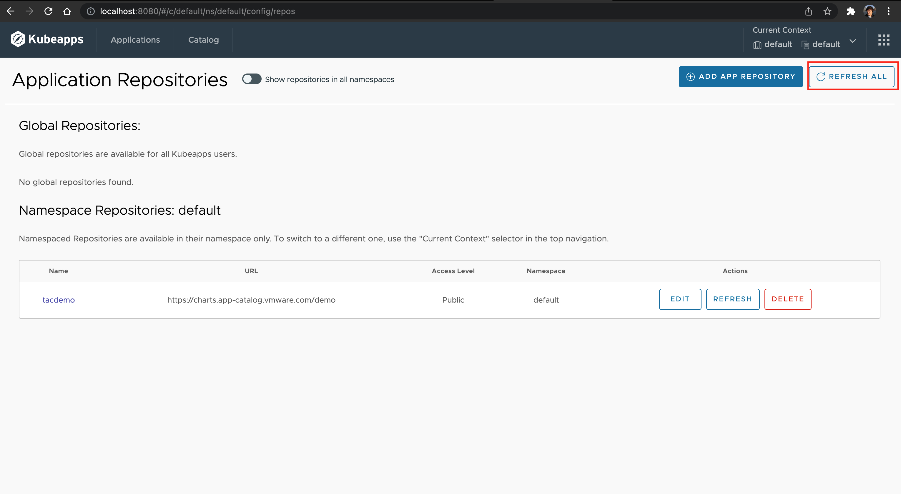

# VAC의 Chart + Kubeapps를 이용해 배포

### 1. Repository 등록하기

1. Kubeapps Dashboard UI에 로그인을 한 후 오른쪽 상단에 있는 바둑판 모양을 클릭하면 관리자 메뉴가 나옵니다. 여기에서 App Repositories를 클릭합니다.

2. Add App Repository를 클릭합니다.

3. repository 이름을 입력하고 URL 주소를 입력합니다. 이 Lab에서는 demo chart의 이름으로 https://charts.app-catalog.vmware.com/demo 를 입력합니다.
아래로 Scroll 해서 'Install Repo'를 클릭합니다.

4. Refresh All 을 클릭합니다.

5. 위쪽 메뉴에서 Catalog를 클릭해 보면 application 목록이 보이게 됩니다.
apache를 선택해서 배포를 해보도록 하겠습니다.

6. Apache Chart에 의해서 제공되는 설명 정보들이 나옵니다. Deploy 버튼을 클릭합니다.

7. 생성 될 application 이름을 입력하고 아래에 있는 Deploy 버튼을 클릭합니다.

8. 잠시 기다린 후에 배포가 정상적으로 끝나면 Ready 상태가 되게 됩니다. Service Type Load Balancer로 되어 있기 때문에 Kubernetes 환경이 앞 단에 Load Balancer가 연동이 되어 있어야 합니다. 정상적으로 배포가 되면 URL이 보이게 됩니다. 만들어진 URL을 클릭해 봅니다.

9. apache가 정상적으로 동작하는 것을 확인할 수 있습니다.

10. Kubeapps 대쉬보드에서 Applications를 다시 클릭해보면 apache가 배포되어 있는 것을 확인할 수 있습니다. 새로운 chart가 update된 경우에 upgrade를 수행할 수 있고 특정 버전으로 Rollback 이나 Delete를 수행할 수 있습니다.

이번 Lab을 정상적으로 완료했습니다.

[이전으로 가기](../)