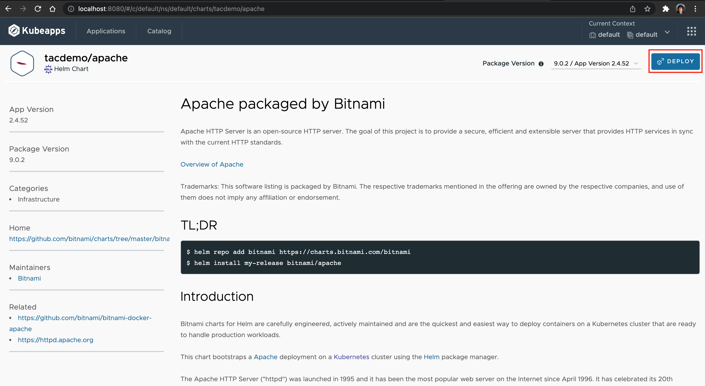

# VAC의 Chart + Kubeapps를 이용해 배포

### 1. Repository 등록하기

1. Kubeapps Dashboard UI에 로그인을 한 후 오른쪽 상단에 있는 바둑판 모양을 클릭하면 관리자 메뉴가 나옵니다. 여기에서 App Repositories를 클릭합니다.

2. Add App Repository를 클릭합니다.

3. repository 이름을 입력하고 URL 주소를 입력합니다. 이 Lab에서는 demo chart의 이름으로 https://charts.app-catalog.vmware.com/demo 를 입력합니다.
아래로 Scroll 해서 'Install Repo'를 클릭합니다.

4. 

