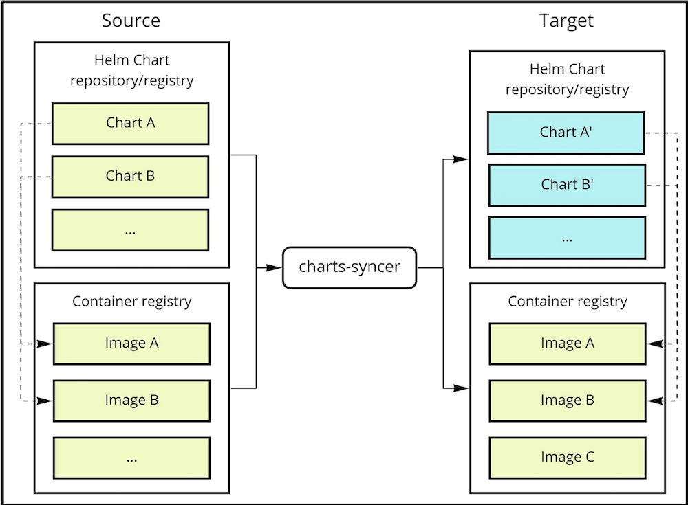
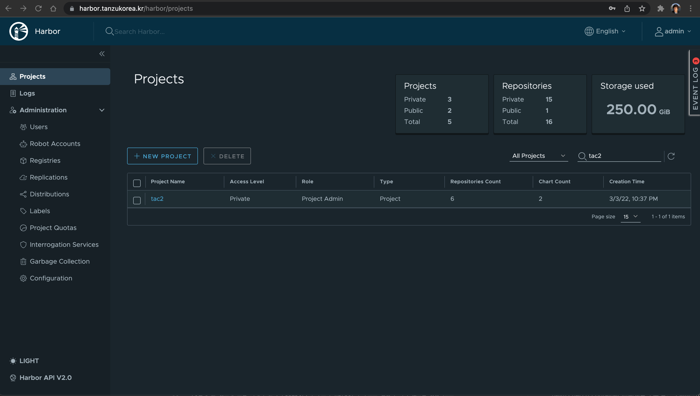
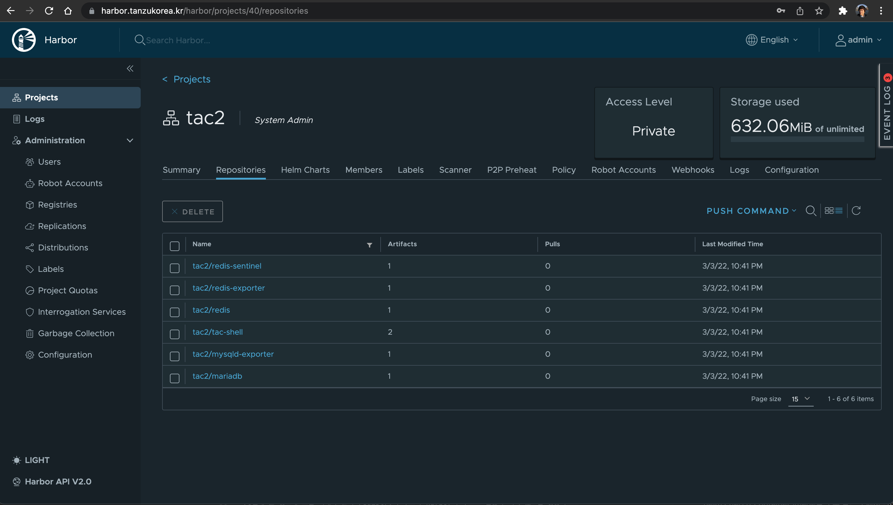
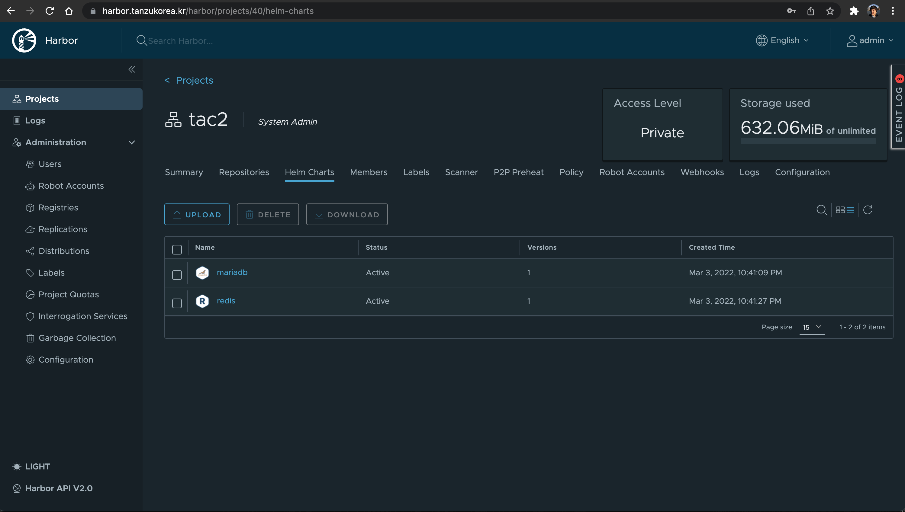
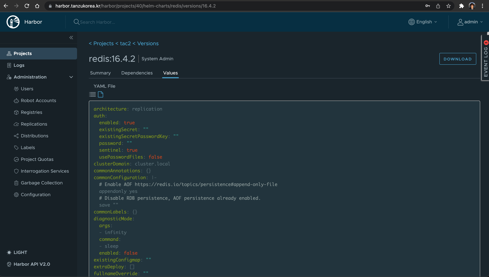

# VAC --> Harbor : Chart와 이미지 전송
Chart-Syncer는 Helm chart와 관련 container 이미지를 source로 부터 target로 복사해주는 오픈소스 툴입니다.



이번 Lab에서는 chart-syncer툴을 이용해 VAC에 있는 Helm Chart와 Container 이미지들을 On-Premise의 Harbor에 복사하는 과정을 수행합니다.

## 1. chart-syncer 설치
아래의 주소에서 바이너를 받아 local 환경에 설치를 합니다.
https://github.com/bitnami-labs/charts-syncer/releases


## 2. 설정파일 만들기
chart-syncer에서 사용할 설정 파일을 아래와 같이 파일을 (예:config.yaml) 생성합니다.

```
  source:
      repo:
        kind: HELM
        url: https://charts.app-catalog.vmware.com/demo

  target:
    repo:
      kind: HARBOR
      url: https://harbor.tanzukorea.kr/chartrepo/tac2
    containerRegistry: harbor.tanzukorea.kr
    containerRepository: tac2

  # Whether to also push the associated container images
  relocateContainerImages: true

  charts:
    - redis
    - mariadb
  # While syncing VMware application Catalog repositories we want to skip the "common" chart since it's a special case
  #skipCharts:
  #    - common
```

1) 위의 target url 에 Harbor domain 주소를 입력합니다.

    harbor.tanzukorea.kr ==> Harbor 주소로 변경
2) repository 이름을 변경합니다.

    tac2 ==> Harbor의 project 이름으로 변경

위 설정은 소스 Application으로 부터 helm chart와 container 이미지를 모두 받는 설정입니다.
chart의 주소는 https://charts.app-catalog.vmware.com/demo이고 여기에서 demo는 application 이름의 주소입니다.

```
  charts:
    - redis
    - mariadb
```
모든 charts 중에서 특정한 chart만 filtering을 해서 download를 받기 위해 redis와 mariadb 만을 다운로드 받도록 설정했습니다. 

위 설정을 제거하면 모든 chart를 다운로드 받습니다. 
데모 application의 모든 charts와 container를 다운로드 받기 위해서는 100G 이상이 필요하고 2시간 이상이 소요됩니다.

## 3. Harbor에서 project 생성하기
위 설정 파일에서 사용한 project 를 생성합니다.
위의 예제에서는 tac2라는 이름을 사용했습니다. 
New Porject를 클릭해서 tac2라는 이름으로 생성합니다.


## 4. chart-syncer 실행하기

chart-syncer를 실행하기에 전에 다음 환경변수를 설정해야 합니다.

아래의 admin / Harbor12345 로 되어 있는 부분을 Harbor 계정정보로 수정하신 후 적용하세요. Windows의 경우 cmd창에서 export 대신 SET 으로 설정하시면 됩니다.

```
export TARGET_REPO_AUTH_USERNAME=admin
export TARGET_REPO_AUTH_PASSWORD=Harbor12345
export TARGET_CONTAINERS_AUTH_USERNAME=admin
export TARGET_CONTAINERS_AUTH_PASSWORD=Harbor12345
```

위에서 생성한 yaml 파일을 (예: config.yaml) 아래와 같이 -c 옵션을 넣고 실행합니다.
image 중에서 가장 최신 버전만 download 하도록 latest-version-only 옵션을 넣습니다.

```
charts-syncer sync -c config.yaml --latest-version-only
```

## 5. Harbor에서 확인하기

tac2 Project로 들어가면 아래와 같이 Repositories에 다운로드 된 것을 확인할 수 있습니다.
이 Lab에서는 Helm Chart는 Helm Charts 다운로드시 별도로 관리되도록 설정했습니다. 만약 Harbor에 Helm Charts 탭이 보이지 않을 경우 Harbor 설치시에 chartmuseum을 사용해야 합니다.

* Harbor에서는 OCI 호환방식을 제공하고 있는데, 이 방식은 helm chart와 container image를 모두 같은 곳에서 관리도 가능합니다. OCI 호환방식을 사용하려면 위의 target->repo->kind=OCI 로 설정하면 됩니다. 

Repositories에는 container의 내용을 담고 있습니다. 각각 클릭하여 내용을 확인할 수 있습니다.



Helm Charts 탭에서 chart 하나를 클릭해 들어간 후 


Values 클릭합니다. 



70번째 줄 정도에 보면 아래와 같이 registry의 주소가 harbor의 주소로 변경이 되어 있으면 정상적으로 이동이 된 것입니다.

```
image:
  registry: harbor.tanzukorea.kr
  repository: tac2/redis
```

Lab을 정상적으로 완료하셨습니다.

[이전으로 가기](./vac_onpremise.md)