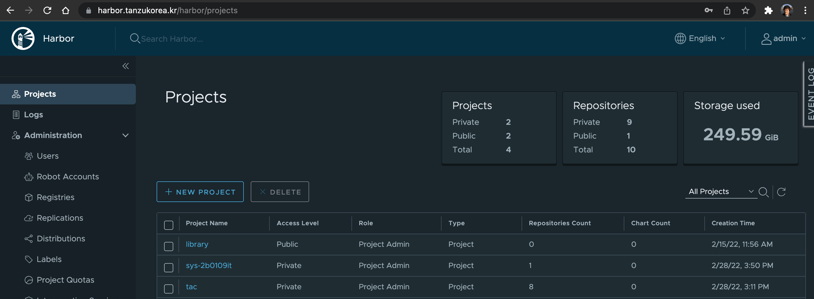

# VAC --> Harbor : Chart와 이미지 전송
Chart-Syncer는 Helm chart와 관련 container 이미지를 source로 부터 target로 복사해주는 오픈소스 툴입니다.


## 1. chart-syncer 설치
아래의 주소에서 바이너를 받아 local 환경에 설치를 합니다.
https://github.com/bitnami-labs/charts-syncer/releases


## 2. 설정파일 만들기
chart-syncer에서 사용할 설정 파일을 아래와 같이 yaml 파일로 생성합니다.

```
  source:
      repo:
        kind: HELM
        url: https://charts.app-catalog.vmware.com/demo

  target:
    repo:
      kind: OCI
      url: https://harbor.tanzukorea.kr/tac/charts
    containerRegistry: harbor.tanzukorea.kr
    containerRepository: tac

  # Whether to also push the associated container images
  relocateContainerImages: true

  charts:
    - redis
    - mariadb
  # While syncing VMware application Catalog repositories we want to skip the "common" chart since it's a special case
  #skipCharts:
  #    - common
```

1) 위의 target url 에 Harbor domain 주소를 입력합니다.

    harbor.tanzukorea.kr ==> Harbor 주소로 변경
2) repository 이름을 변경합니다.

    tac ==> Harbor의 project 이름으로 변경

## 3. Harbor에서 project 생성하기
위 설정 파일에서 사용한 project 를 생성합니다.
위의 예제에서는 tac라는 이름을 사용했습니다. 
New Porject를 클릭해서 tac라는 이름으로 생성합니다.


[이전으로 가기](./vac_onpremise.md)