# VAC Console UI 살펴보기

### 1. VMware Cloud Login
VMware Cloud Console에 접속합니다. VMware 계정이 없을 경우 'VMware 계정 생성'을 눌러 계정을 생성합니다.
계정이 있으신 경우 이메일 주소로 로그인을 합니다.
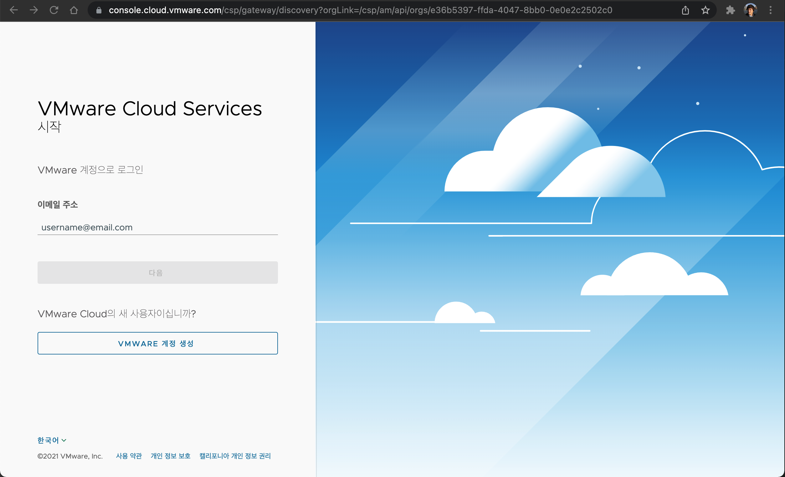

### 2. Demo 환경으로 조직 변경
Instructor로 부터 부여받은 Demo 환경의 조직으로 변경을 합니다. (여기서는 ACME)
* 기존에 별도의 조직이 없는 경우에는 기본적으로 선택이 되어 있으므로 변경하지 않으셔도 됩니다.
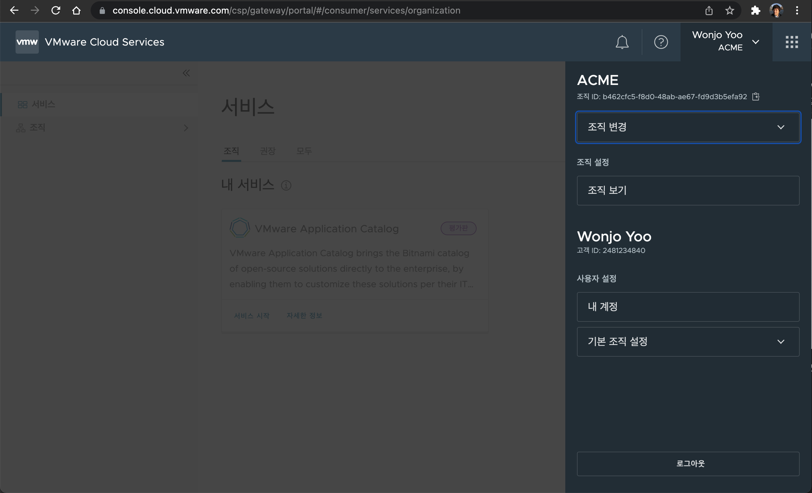

### 3. VMware Application Catalog 서비스로 이동
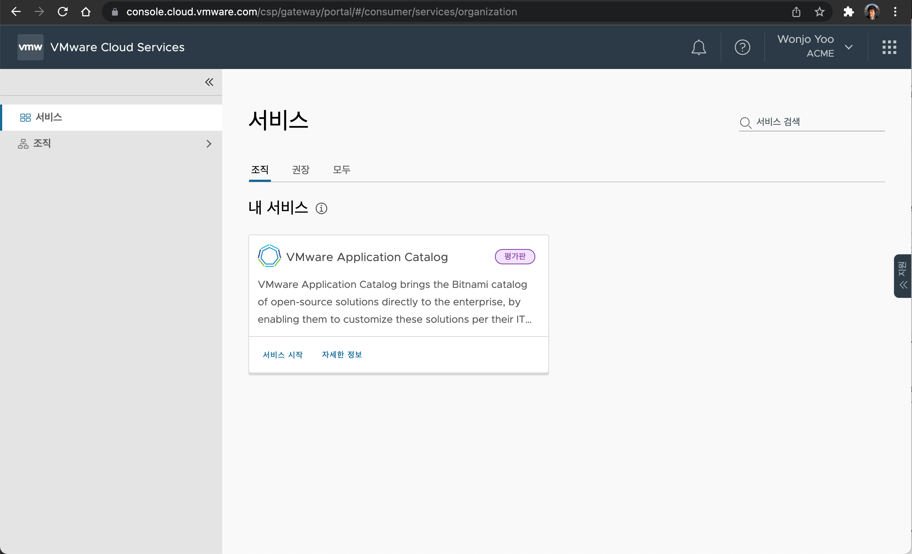
### 4. Demo용 Catalog 탐색
미리 부여 받은 Demo용 환경에서는 미리 준비된 Application Catalog를 탐색할 수 있습니다.
이 환경은 이미 다양한 Application들을 다운로드 받을 수 있도록 준비가 된 환경입니다.
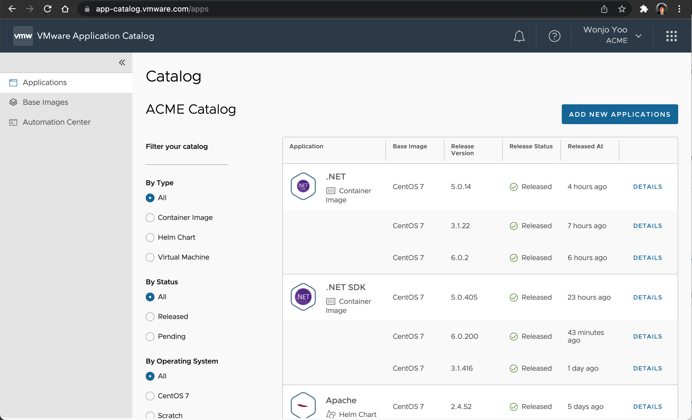

왼쪽에 Filter your catalog에서 다양한 옵션으로 검색을 할 수 있습니다. 
'apache'라고 쳐서 특정한 application을 검색해 보겠습니다.
Apache만 검색이 되는 것을 확인할 수 있습니다.  
Vmware Applicatino Catalog에서는 Apache에 대한 Helm Chart와 Image가 함께 제공이 됩니다.
이제 Helm Chart에 대해서 오른쪽에서 Details를 눌러 상세 화면으로 이동해보겠습니다.
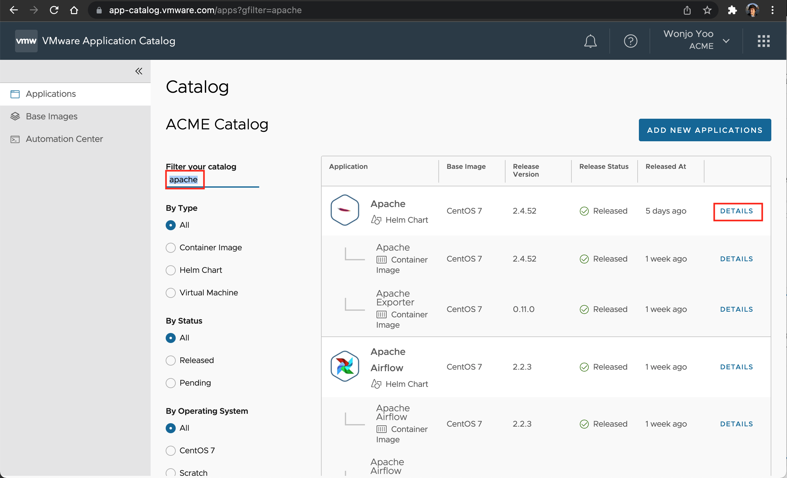

Apache의 Helm Chart를 확인할 수 있고, 아래에 이 chart를 바로 설치해서 사용할 수 있는 helm command를 확인할 수 있습니다.
Helm repository는 https://charts.app-catalog.vmware.com 에서 제공되는 것을 확인할 수 있습니다.
여기에 application 이름이 demo로 되어 있습니다. 
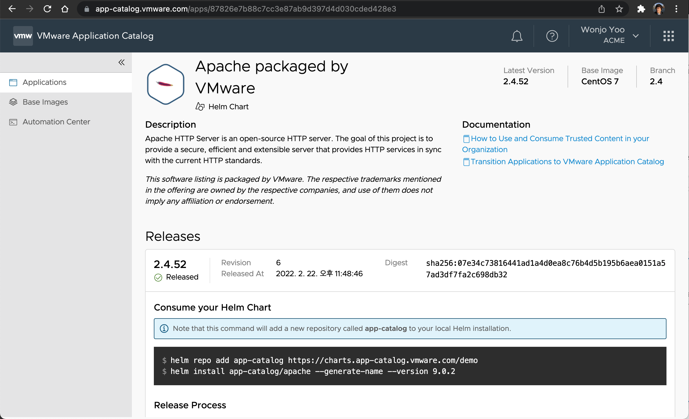

이전 화면으로 이동 한 후에, 이번에는 Apache Container에 대한 Details를 클릭해서 상세 화면으로 이동해 봅니다.
이 화면에서는 Container 이미지를 직접 사용할 수 있는 command를 확인할 수 있습니다.
지금 보고 있는 Demo환경은 저장소를 google gcr로 되어 있기 때문에 다운로드 받는 registry의 이름이 gcr.io로 되어 있습니다. 실제 운영 환경에서 사용할 경우에는 사용자가 지정한 registry가 나오게 됩니다.
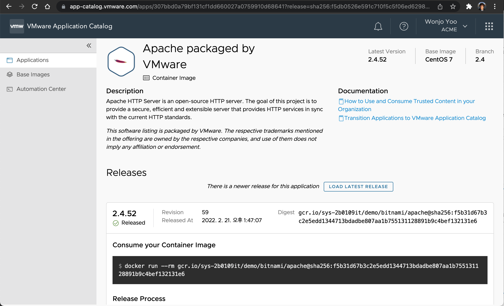

### 5. 새로운 Application 생성하기
운영 환경에서는 다운로드 받고자 하는 Application을 선택하는 과정을 수행하셔야 합니다. 오른쪽 상단에 있는 'Add New Applications'를 클릭합니다.
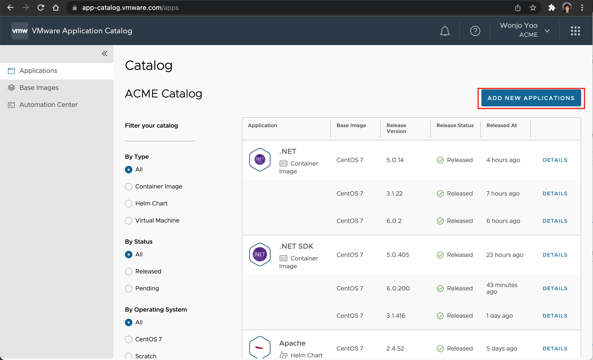

Vmware Application Catalog에서는 Kubernetes Container 이미지 뿐만 아니라 VM이미지도 같이 제공을 하고 있습니다. 여기에서는 Kubernetes Container 이미지를 선택하겠습니다.
제공하고 있는 다양한 base OS의 image중 하나를 선택하고 Next를 누릅니다.
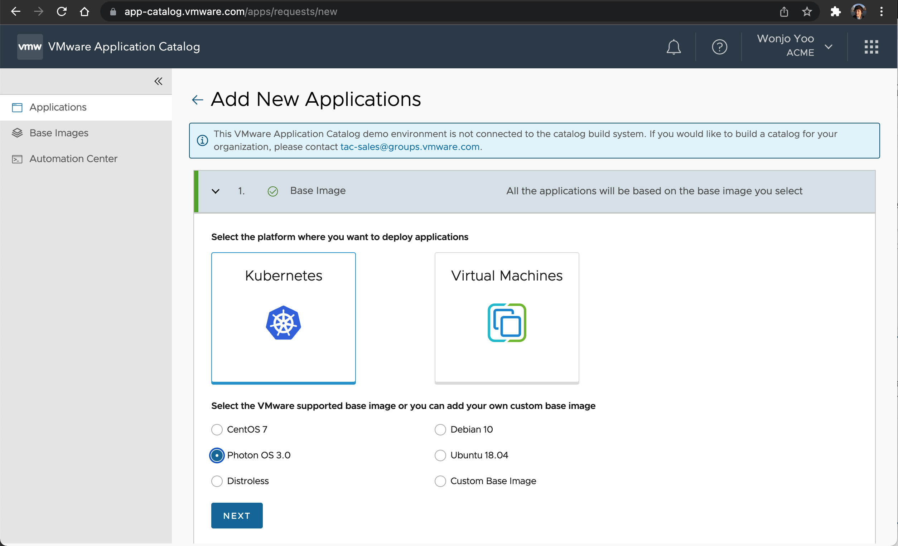

제공하는 Application들 중에 사용하고자 하는 Application 들을 선택합니다. 이때 Helm Chart와 Container image를 선택하고 Next를 누릅니다.
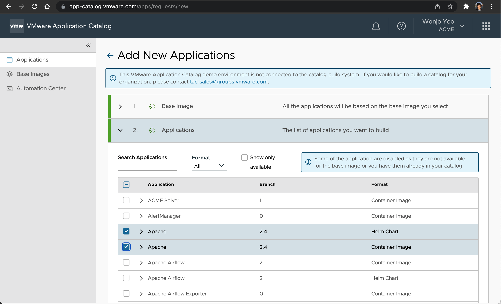

이 단계는 Image가 저장되는 Target Registry를 선택하는 화면입니다.
Demo환경에서는 Registry를 선택하는 화면을 제공하고 있지 않습니다. Next를 누릅니다.
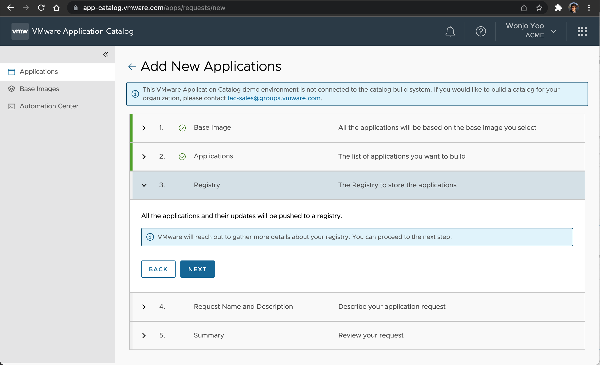

* 운영 환경에서는 아래와 같이 Add registry를 할 수 있습니다.
Add Registry에서는 Google GCR, Azure Container Registry, Harbor 를 선택해서 저장할 수 있습니다.
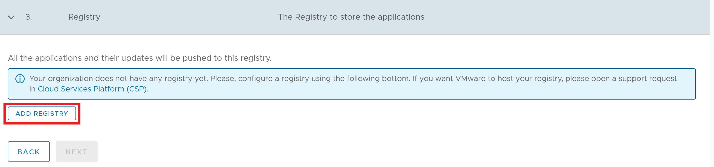

application의 이름을 입력합니다. 여기에서는 apache라고 하겠습니다.
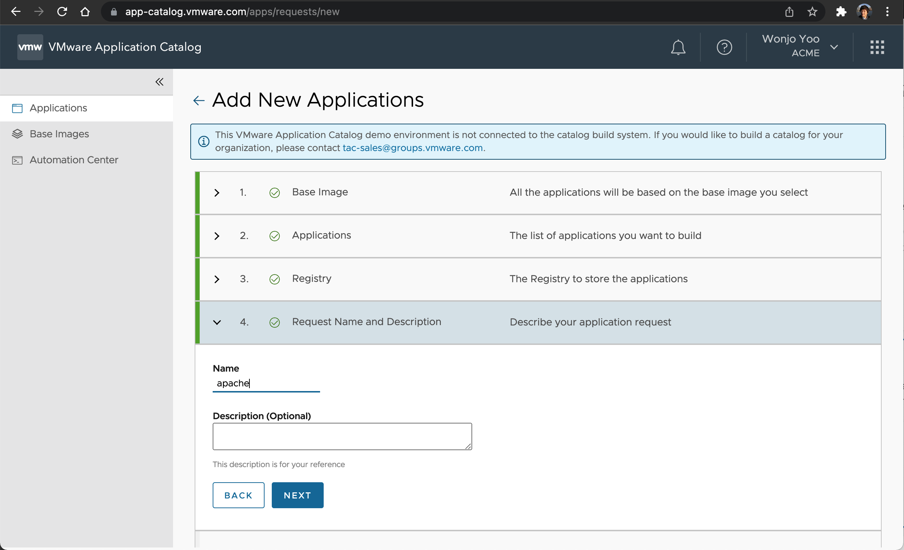

Summary정보를 보여줍니다. 현재 license에서 총 몇개가 사용가능한지와 이 application에서 Active Artifact를 몇개 사용하는지 보여줍니다. 총 25개 중에 2개를 사용하게 되는 것이고, 23개가 남게 됩니다.
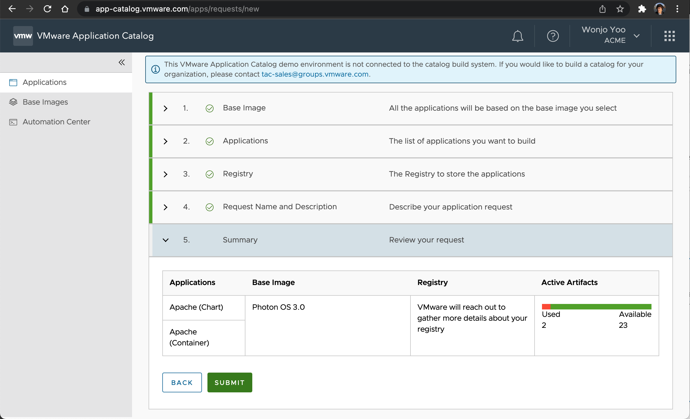

Sumit을 누르게 되면 요청이 전송이 되게 됩니다. application이 생성이 되는데 까지는 시간이 소요되며 요청이 완료되어 image가 준비가 되면 통보가 되게 됩니다. 
* 이 데모 환경에서는 미리 준비되어 있는 application을 제공하기 때문에 이 과정은 수행이 되지 않습니다. 

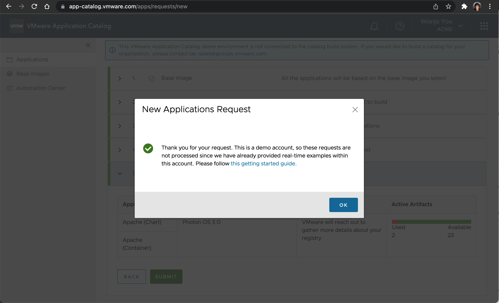

[이전으로 가기](../)
