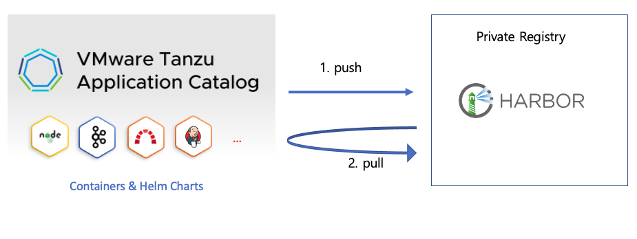

# VAC --> Harbor 이미지 전송
VAC의 Application 생성시에 기본적으로 registry를 Harbor로 지정할 수 있습니다.
이 경우에는 Harbor URL 주소와 계정정보를 입력하기만 하면 됩니다. 그리고 Harbor가 DMZ 내부에 있는 경우 방화벽을 열어 주어야 합니다. 이 방식은 아래 그림에서 1번 push 방식에 해당합니다.

VAC는 직접 Push하는 방식 이외에 Pull 방식을 제공하고 있습니다. 
Pull 방식은 다음의 두가지 방법으로 on-premise로 이미지를 전달 할 수 있습니다. 

Harbor Replication 방식은 직접 Harbor에서 이미지를 가져가는 방식으로 Container 이미지만 받아갈 수 있습니다.

VAC에서는 Chart도 리소스로 제공하고 있는데 Harbor Replication 방식으로는 이미지만 가져갈 수 있기 때문에, 두번째 방식인 Chart-Syncer를 사용하는 것을 권고합니다. Chart-Syncer에서는 chart와 이미지를 모두 가져갈 수 있습니다.

1. [Harbor Replication (Container Image만 전송 가능)](vac_harbor_replication.md)
2. [오픈소스 Chart-Syncer 툴 이용 (chart / Container Image 모두 가능)](vac_chartsyncer.md)

